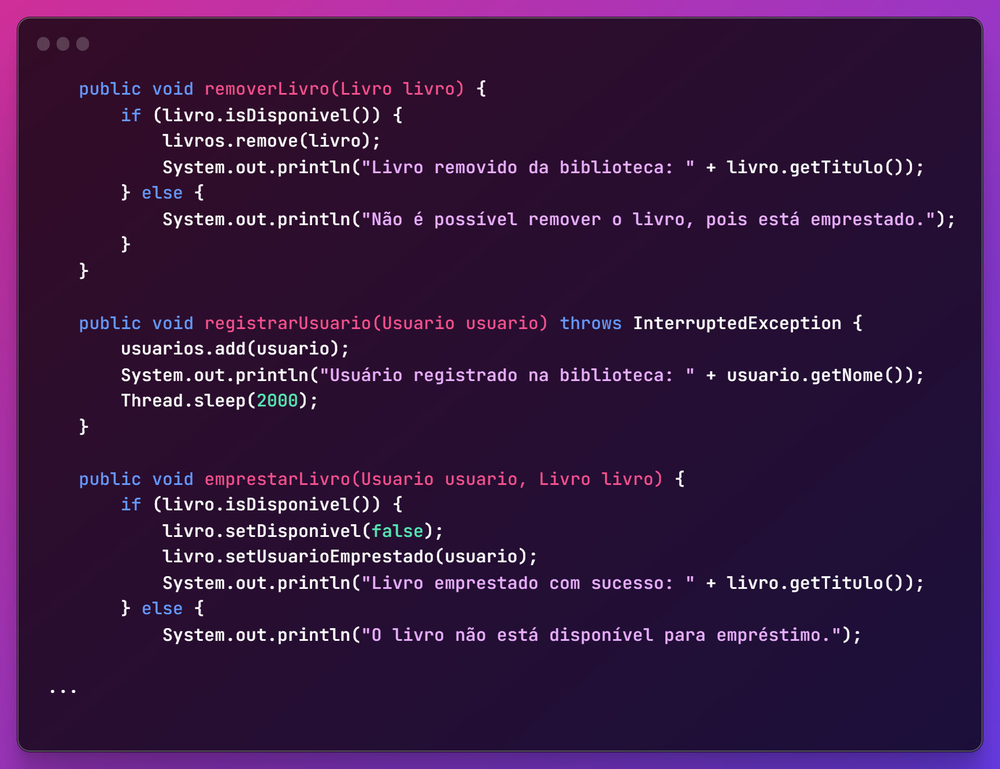

<h1 align="center">ArchivumLibris API</h1>

<div align="center">
  
</div>

<h2 align="center">
  A modern RESTful API for a book management system built with Spring Boot
</h2>

<h3 align="center">
  <strong>The system provides endpoints for managing books, users, and purchases with a clean, maintainable architecture.</strong>
</h3>

<br/>

<h2 align="center">:sparkler: Architecture</h2>

<h3 align="center">
  This project implements <strong>Hexagonal Architecture</strong> (Ports and Adapters) with Feature Slices organization to achieve:
  <ul align="center" style="list-style-position: inside;">
    <li>Clear separation of concerns</li>
    <li>Domain-driven design</li>
    <li>Testability at all levels</li>
    <li>Technology independence</li>
  </ul>
</h3>

<br/>

<h2 align="center">:building_construction: Project Structure</h2>

```
ArchivumLibris-API/
│
├── src/main/java/com/archivumlibris/
│   ├── application/        # Application services and DTOs
│   ├── domain/             # Domain entities and business logic
│   ├── adapter/
│   │   ├── in/             # Input adapters (REST controllers)
│   │   └── out/            # Output adapters (Repositories, external services)
│   │
│   ├── config/             # Application configurations
│   └── ArchivumLibrisApiApplication.java
│
└── src/main/resources/     # Configuration files and resources
```

<br/>

<h2 align="center">:bulb: Key Concepts</h2>

<h3 align="center">
  The architecture supports the core object-oriented principles:
  <ul align="center" style="list-style-position: inside;">
    <li><i>Encapsulation</i> - through well-defined boundaries</li>
    <li><i>Inheritance</i> - in domain models where appropriate</li>
    <li><i>Polymorphism</i> - via interfaces at architecture boundaries</li>
    <li><i>Abstraction</i> - through ports defining clear contracts</li>
  </ul>
</h3>

<br/>

<h2 align="center">:rocket: Features</h2>

<div align="center">
  <h3>:books: Book Management</h3>
  <p>Create, update, delete, and search books</p>
  
  <h3>:busts_in_silhouette: User Management</h3>
  <p>User registration, authentication, and profile management</p>
  
  <h3>:shopping_cart: Purchase Processing</h3>
  <p>Create and manage book purchases</p>
</div>

<br/>

<div align="center">
  
</div>

<br/>

<div align="center">
  <h2>:gear: Technologies</h2>
  <p>
    <strong>Spring Boot</strong> • 
    <strong>Spring Data JPA</strong> • 
    <strong>Spring Security</strong> • 
    <strong>Flyway</strong> • 
    <strong>PostgreSQL</strong> • 
    <strong>Swagger</strong>
  </p>
</div>
